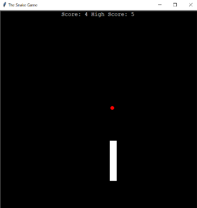

# Snake Game from old Mobiles | Python

⚠️ _This was done as I followed up Angela Yu's Python Bootcamp tutorial on the Snake Game. You can find the course [on Udemy here](https://www.udemy.com/course/100-days-of-code/)._ ⚠️

This is the famous snake game from old mobiles recreated in Python.

The Turtle Module was used for this game. Concepts of Object Oriented Programming (OOP) were also used.

# Jogo da Cobrinha dos Celulares Antigos | Python

 ⚠️ _Isso foi criado enquanto eu seguia o tutorial do Jogo da Cobrinha do Bootcamp de Python da Angela Yu. O curso está [disponível na Udemy aqui](https://www.udemy.com/course/100-days-of-code/)_. ⚠️

O famoso jogo da cobrinha dos celulares antigos recriado em Python.

O módulo da tartaruga (Turtle Module) foi usado para esse jogo, bem como conceitos da Programação Orientada a Objetos (POO).
